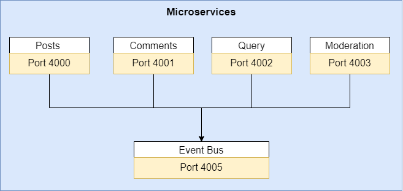

# Microservices

A serveless application to study how microservices work.

## 💻 Project

This is a very simple application to study and understand the microservices architecture. Services implemented:

<h1 align="center">
    
</h1>

- Posts
- Comments
- Query
- Moderation
- Event bus (to catch all events from other services)

## :gear: How to run 

```
git clone https://github.com/debfdias/microservices

```

Each services needs to run in a different command window. Access each folder and run: 

```
npm i
npm start

```

The client is built in React Js, to run type:

```
npm i
react start

```
